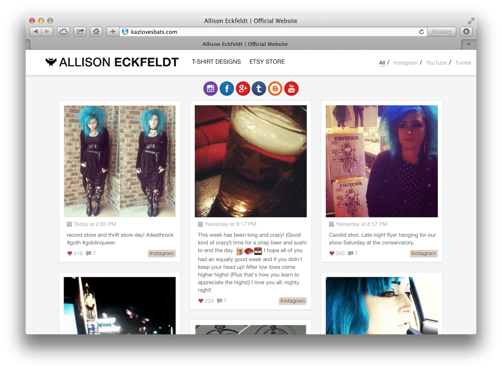
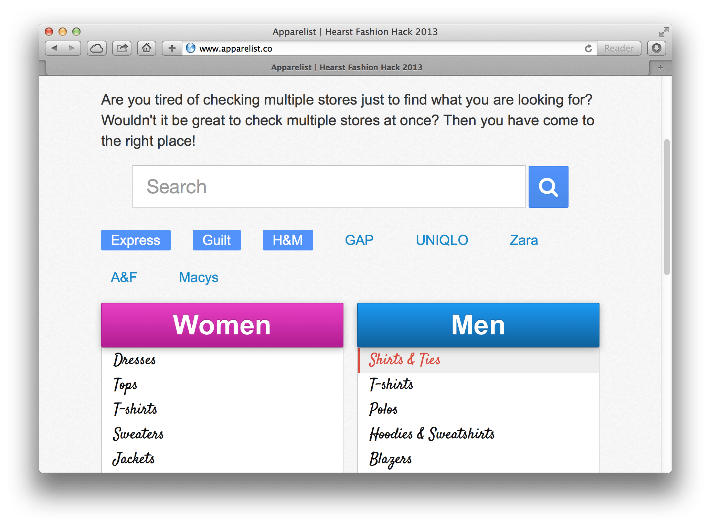

# ShowTrackr

#### Angular.js, Node.js, MongoDB, Sass

TV Show Tracker built for my talk at the [Node.js NYC Meetup](http://meetup.com/nodejs/).
Using Express REST API on the back-end and Angular.js on the front-end.

<a href="https://github.com/sahat/tvshow-tracker/" class="btn btn-default">Source Code</a>

# JS Recipes

#### Angular.js

Hand-written collection of JavaScript tutorials for backend and frontend development.

<a href="http://jsrecipes.org/" class="btn btn-success">Live Demo</a>
<a href="https://github.com/sahat/jsrecipes/" class="btn btn-default">Source Code</a>

# Angel Beats

#### Node.js, Socket.IO

Real-time synchronized audio playback across multiple connected web browser clients.
This allows you to boost the sound by playing the song on more than one device simultaneously.

<a href="http://angelbeats.herokuapp.com" class="btn btn-success">Live Demo</a>
<a href="https://github.com/sahat/angelbeats" class="btn btn-default">Source Code</a>

# Hackathon Starter

#### Node.js, MongoDB, LESS, Mocha

<iframe src="http://ghbtns.com/github-btn.html?wmode=opaque&amp;user=sahat&amp;repo=hackathon-starter&amp;type=watch&amp;count=true&amp;size=large" allowtransparency="true" frameborder="0" scrolling="0" width="170" height="30"></iframe>

Hackathon Starter is a boilerplate for Node.js web applications.
When I started this project, my primary focus was on <em>simplicity</em> and <em>ease of use</em>.
Anyone who knows a little bit of JavaScript should be able to get started without too much pain.
I tried to make it as <em>generic</em> and <em>reusable</em> as possible to cover most use cases
of hackathon web apps, without being too specific.

*Featured in <a href="http://nodeweekly.com/issues/20">Node Weekly - Issue 20</a>*

*Featured in <a href="http://javascriptweekly.com/issues/166">JavaScript Weekly - Issue 166</a>*

### Features

* Local Authentication using Email and Password
* OAuth 1.0a Authentication via Twitter
* OAuth 2.0 Authentication via Facebook, Google or GitHub
* Awesome flash notifications with animations by animate.css
* MVC Project Structure
* Node.js clusters support
* Rails 3.1-style asset pipeline
* LESS stylesheets
* Bootstrap 3 + Flat UI + iOS7 Theme
* Contact Form (powered by Mailgun, Sendgrid or Mandrill)
* Account Management
  * Gravatar
  * Profile Details
  * Change Password
  * Link multiple OAuth strategies to one account
  * Delete Account
  * Forgot Your Password
  * API Examples: Facebook, Foursquare, Venmo, LinkedIn, Tumblr, Twitter, Stripe, and more.

<a href="hackathonstarter.herokuapp.com" class="btn btn-success">Live Demo</a>
<a href="https://github.com/sahat/hackathon-starter" class="btn btn-default">Source Code</a>

# Ember + Sass + Express Starter

#### Ember.js, Node.js, Sass, MongoDB

This project provides a starting point for your Ember apps with
Express web framework serving as a RESTful API back-end.
Directory structure is heavily influenced by ember-tools and Ember App Kit.
In fact it is designed to work with ember-tools for quickly scaffolding models,
views, template, routes and controllers.

  <a href="https://github.com/sahat/ember-sass-express-starter" class="btn btn-default">Source Code</a>

# Esoterik Band

#### Node.js, Stylus, MongoDB
The official website of the new music band - Esoterik.
They combine 80s Synthpop and Dark Wave with Electronic Dance.

  <a href="http://www.esoterikmusic.com" class="btn btn-success">Live Demo</a>

# Coffeed

#### Node.js, MongoDB

Lets you place and manage your orders for food, drinks, or any other predefined items.
Admin can add or remove new store items and store locations. Developed for an internal use
at my friend's coffee shop in New York City.

  <a href="https://github.com/sahat/coffeed" class="btn btn-default">Source Code</a>

# Require.js Library Skeleton

#### Require.js, Grunt.js, Bower, Jasmine, Mocha, Chai, Karma, Travis CI

<iframe src="http://ghbtns.com/github-btn.html?wmode=opaque&amp;user=sahat&amp;repo=requirejs-library&amp;type=watch&amp;count=true&amp;size=large"
        allowtransparency="true" frameborder="0" scrolling="0" width="170" height="30">
</iframe>

*Featured in JavaScript Weekly - Issue 155*

Skeleton project for building modular javascript libraries using Require.js.
Comes with Jasmine & Mocha testing frameworks, Karma test runner and Grunt task runner.

  <a href="https://rawgithub.com/sahat/requirejs-library/master/demo/inline.html" class="btn btn-success">Live Demo</a>
  <a href="https://github.com/sahat/requirejs-library" class="btn btn-default">Source Code</a>

# CloudBucket (Capstone Project)

#### Node.js, Python, MongoDB, AWS, jQuery, Grunt.js, Bower, Google OAuth 2.0, Google Books API, SkyBiometry API, Last.fm API, Musixmatch API
CloudBucket is the online cloud storage system with a semantic search capability.
Whenever you upload a file to CloudBucket, it is tagged automatically based on its file contents.
For instance, a music file will receive a covert art, lyrics, artist information, similar artists
and last.fm tags that describe that particular song. You can then, for example, search for a keyword
that is contained in the lyrics of that song and it will return this file in the search results.
Typical search systems return results that match a keyword in the filename only,
not based on its file contents.

  <a href="http://cloudbucket-sahat.rhcloud.com" class="btn btn-success">Live Demo</a>
  <a href="http://github.com/sahat/cloudbucket" class="btn btn-default">Source Code</a>

# New Eden Faces

#### Node.js, Socket.IO, Backbone.js, Require.js, MongoDB, jQuery

The New Eden Faces lets you vote between two randomly selected EVE Online characters of the same gender.
The goal? To see, who are the best looking characters of EVE Online, of course! Other features include
browsing all 7000+ characters using infinite pagination, browse Top 100 sorted by gender, race and bloodline.

  <a href="http://www.newedenfaces.com" class="btn btn-success">Live Demo</a>
  <a href="https://github.com/sahat/newedenfaces" class="btn btn-default">Source Code</a>

# Allison Eckfeldt's Website

#### Underscore.js, jQuery
Allison Eckfeldt's personal website.
Content aggregation is done using YouTube, Instagram and Tumblr APIs completely on client-side via JSONP.

  <a href="http://kazlovesbats.com" class="btn btn-success">Live Demo</a>

# Apparelist

#### Node.js, MongoDB, jQuery

Hearst Fashion Hackathon 2013 project. Browse and compare items from multiple
clothing stores, e.g. Macys, Express, H&M, UNIQLO.

  <a href="https://github.com/sahat/apparelist" class="btn btn-default">Source Code</a>

# Opheliac HTML5 Lyrics

#### jQuery

Audio-text visualization. YouTube has plenty of "lyrics music videos". I thought it would be interesting to create something
similar using CSS and JavaScript. This is a song <em>Opheliac</em> by <em>Emilie Autumn</em>,
where lyrics are perfectly synchronized with the music. Lyrics start after 57 seconds.

  <a href="http://sahat.github.io/opheliac" class="btn btn-success">Live Demo</a>
  <a href="https://github.com/sahat/sahat.github.com/tree/master/opheliac" class="btn btn-default">Source Code</a>

# CL4P-TP Game Recommendation Engine

#### Node.js, - MongoDB, jQuery

The final project for Software Engineering course at the <em>City College of New York</em>.
Some features include: personalized game recommendations based on the rating / purchase
patterns of similar users, profile with XBOX 360 achievements, rating system,
custom signup and login components, custom comments system, store purchases,
YouTube trailer previews, and more!

  <a href="http://csc322.herokuapp.com" class="btn btn-success">Live Demo</a>
  <a href="https://github.com/sahat/csc322" class="btn btn-default">Source Code</a>

